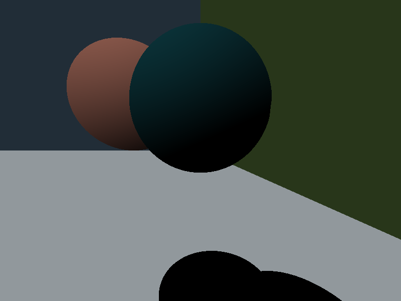

# rust-raytracer
this is a simple raytracer written in rust to help me learn linear algebra and keep me occupied over the summer.
currently it supports spheres.

## todo
- [x] planes
- [x] split into multiple modules
- [x] point light source
- [x] generalize trace function
- [x] shadows
- [ ] fix the infinite loop of trace -> get_pixel -> trace, etc.
- [ ] multiple light sources
- [ ] parallelize render loop

## stretch goals
* other 3D shapes
* texture mapping
* reflections
* ?autostereogram creation?
* ?fast inverse square root?
* ?non euclidean geometry?

## work in progress image:

